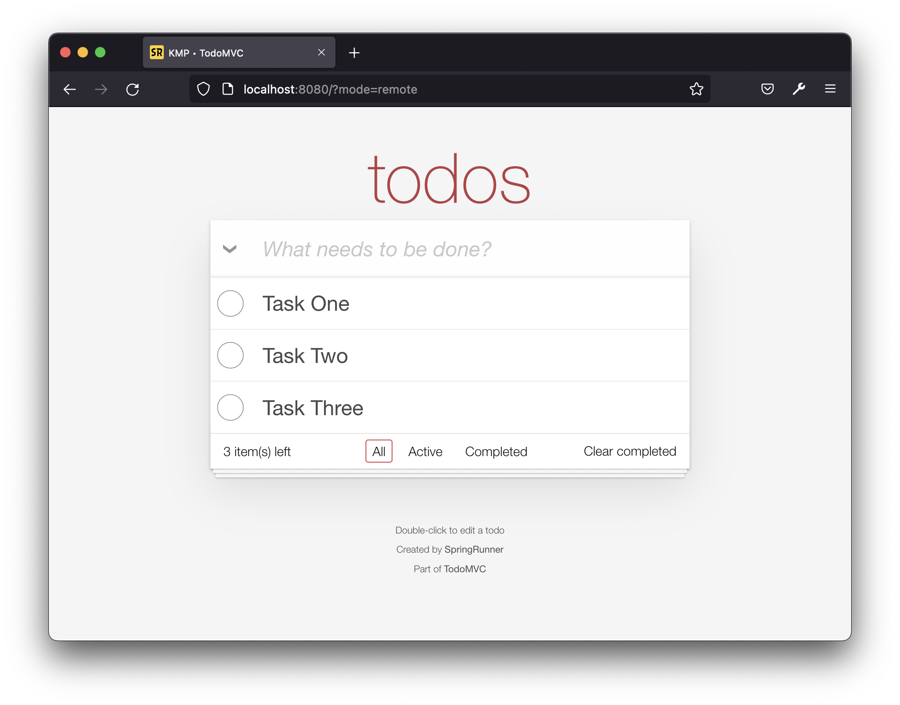
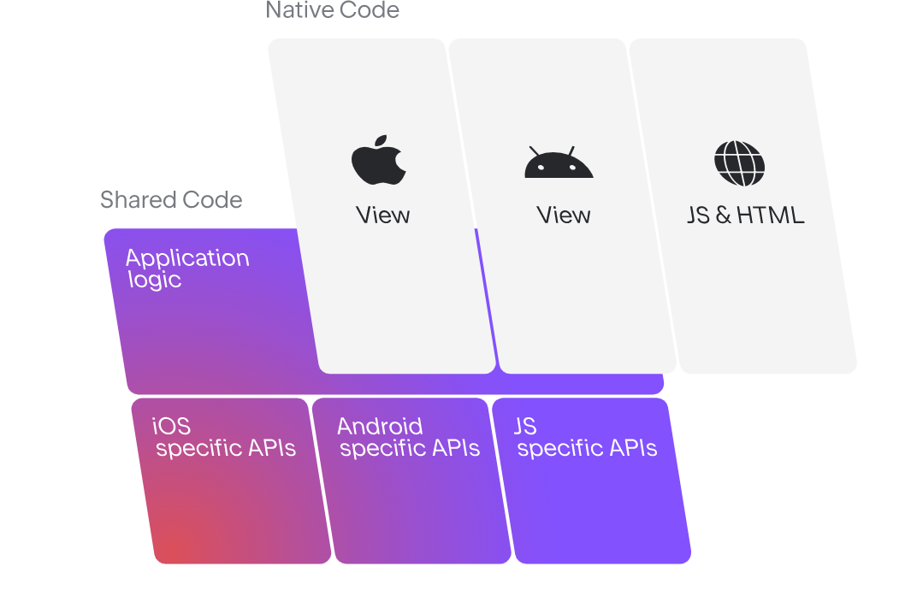

# Building a Full Stack Web App with Kotlin Multiplatform

본 저장소는 [INFCON 2022](https://infcon.day/speaker/박용권-김지헌-코틀린-멀티플랫폼/)에서 코틀린 멀티플랫폼 기반 웹 프로그래밍 핸즈온랩을 위해 작성된 템플릿 프로젝트가 있는 곳입니다.

<div align="center">
    
</div>

핸즈온 과정에서 코틀린 멀티플랫폼을 기반으로 프론트엔드(front-end)는 Kotlin/JS와 리액트(React), 백엔드(back-end)는 Kotlin/JVM과 스프링(Spring)을 사용해 풀스택 웹 애플리케이션이 만듭니다.

### 코틀린 멀티플랫폼

<div align="center">
    
</div>

코틀린은 멀티플랫폼을 지원하는 언어로 JVM 기반 Server-side 및 Android 뿐만이 아니라 JavaScript 엔진이 있는 브라우저나 Node.js, 그리고 iOS, Linux, Windows 등 여러가지 Native 플랫폼에서도 쓸 수 있습니다. 이를 이용해 코틀린 코드를 공유하는 단일 코드베이스로 모바일부터 웹과 데스크톱, 서버에 이르기까지 멀티플랫폼 애플리케이션을 작성할 수 있습니다. 

코틀린 멀티플랫폼 프로젝트는 아직 알파 버전이지만 실용적인 가능성에 기대어 기업에서 여러가지 시도를 하고 있습니다. 넷플릭스에서는 TV프로그램과 영화의 제작을 혁신적으로 제공하기 위해 Prodicle 앱을 개발하면서 코틀린으로 작성한 비즈니스 로직을 Kotlin/Native를 통해 Android용 Kotlin 라이브러리와 iOS용 기본 유니버설 프레임워크로 컴파일함해서 사용하고 있으며, 필립스는 자사의 제품들이 클라우드를 기반으로 통합되어 제품간의 검색, 연결 및 상호 작용을 위해 Android 및 iOS, 그리고 임베디드 Linux를 지원하는 
SDK를 개발하며 코틀린 멀티플랫폼을 사용했습니다.

## 프로젝트 구성
```
├── gradle
├── gradle.properties
├── gradlew
├── gradlew.bat
├── settings.gradle.kts
├── build.gradle.kts                             # Gradle build script
└── src
    ├── commonMain                               # Common Kotlin, application code
    │   ├── kotlin
    │   │   └── todoapp
    │   │       ├── application                  # use-case module
    │   │       ├── domain                       # domain module
    │   │       ├── serializer
    │   │       ├── support
    │   │       └── web                          # web adapter module
    │   └── resources
    ├── commonTest                               # Common Kotlin, test code
    │   ├── kotlin
    │   │   └── todoapp    
    │   └── resources
    ├── jsMain                                   # Kotlin/JS, application code
    │   ├── kotlin
    │   │   ├── todoapp
    │   │   │   ├── application                  # use-case module
    │   │   │   ├── ui                           # react-app module
    │   │   │   └── TodoClientApplication.kt     # client entry-point
    │   │   └── external                         # exposes npm dependencies to kotlin
    │   └── resources
    ├── jsTest                                   # Kotlin/JS, test code
    │   ├── kotlin
    │   │   └── external
    │   └── resources
    ├── jvmMain                                  # Kotlin/JVM, application code
    │   ├── kotlin
    │   │   └── todoapp
    │   │       ├── application                  # use-case module
    │   │       ├── data                         # data adapter module
    │   │       ├── web                          # web adapter module
    │   │       └── TodoServerApplication.kt     # server entry-point
    │   └── resources
    │       ├── static                           # static resources (images)
    │       ├── application.yml                  # spring-boot externalized configuration
    │       ├── schema.sql                       # database schema create script
    │       └── data.sql                         # database data init script
    └── jvmTest                                  # Kotlin/JVM, test code
        ├── kotlin        
        │   └── todoapp
        └── resources
```

## 개발 환경
- Kotlin 1.6.x (with Java 11)
- Share common-code
  - [Common Kotlin](https://kotlinlang.org/docs/multiplatform.html)
  - [Kotlin Coroutines](https://kotlinlang.org/docs/coroutines-overview.html)
  - [Kotlin Serialization](https://kotlinlang.org/docs/serialization.html)
  - [Kotlin Logging](https://github.com/MicroUtils/kotlin-logging)
  - [Kotlin Test](https://kotlinlang.org/api/latest/kotlin.test/)
- Front-end
  - [Kotlin/JS](https://kotlinlang.org/docs/js-overview.html) 
  - [React](https://ko.reactjs.org) 18.0.x
  - [MUI](https://mui.com) 5.6.x
  - [Emotion](https://emotion.sh/docs/introduction) 11.9.x
  - [Ktor](https://ktor.io) 2.0.x
- Back-end
  - [Kotlin/JVM](https://kotlinlang.org/docs/server-overview.html) 
  - [Spring WebFlux](https://docs.spring.io/spring-framework/docs/current/reference/html/web-reactive.html) 5.2.x
  - [Spring Data R2DBC](https://spring.io/projects/spring-data-r2dbc) 1.4.x
  - [Spring Boot](https://spring.io/projects/spring-boot) 2.6.x
  - [Kotest](https://kotest.io) 5.0.x (with JUnit 5)
- Tools: Gradle 7.2, IntelliJ IDEA 2022.2 (Community Edition)

## 빌드 및 실행
저장소 코드를 내려받은 후 터미널에서 다음 명령어를 입력하고, 애플리케이션이 실행되면 브라우저에서 [http://localhost:8080/?mode=remote](http://localhost:8080/?mode=remote) 로 접속합니다.

```
❯ ./gradlew clean bootRun

> Configure project :
Kotlin Multiplatform Projects are an Alpha feature. See: https://kotlinlang.org/docs/reference/evolution/components-stability.html. To hide this message, add 'kotlin.mpp.stability.nowarn=true' to the Gradle properties.

> Task :bootRun

  .   ____          _            __ _ _
 /\\ / ___'_ __ _ _(_)_ __  __ _ \ \ \ \
( ( )\___ | '_ | '_| | '_ \/ _` | \ \ \ \
 \\/  ___)| |_)| | | | | || (_| |  ) ) ) )
  '  |____| .__|_| |_|_| |_\__, | / / / /
 =========|_|==============|___/=/_/_/_/
 :: Spring Boot ::                (v2.6.8)
 ...
todoapp.TodoServerApplicationKt      : Started TodoServerApplicationKt in 1.349 seconds (JVM running for 1.504)
o.s.b.f.s.DefaultListableBeanFactory : Returning cached instance of singleton bean 'applicationAvailability'
o.s.b.a.ApplicationAvailabilityBean  : Application availability state LivenessState changed to CORRECT
o.s.b.f.s.DefaultListableBeanFactory : Returning cached instance of singleton bean 'applicationAvailability'
o.s.b.a.ApplicationAvailabilityBean  : Application availability state ReadinessState changed to ACCEPTING_TRAFFIC
<============-> 96% EXECUTING [34s]
> :bootRun
```
